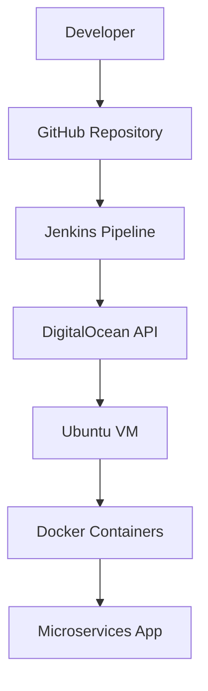

# Pipeline de Infraestructura - Microservice App

Pipeline automatizado de CI/CD para desplegar aplicaciones de microservicios en DigitalOcean usando Jenkins.

# Integrantes

- Ricardo Andrés Chamorro Martinez
- Oscar Stiven Muñoz Ramirez
- Gabriel Ernesto Escobar Bravo

## Tabla de Contenidos

- [Componentes del Pipeline](#-componentes-del-pipeline)
- [Arquitectura del Sistema](#-arquitectura-del-sistema)
- [Configuración Inicial](#️-configuración-inicial)
- [Flujo del Pipeline](#-flujo-del-pipeline)
- [Stages del Pipeline](#-stages-del-pipeline)
- [Control por Commits](#-control-por-commits)
- [Monitoreo y Logs](#-monitoreo-y-logs)
- [Troubleshooting](#-troubleshooting)

## Componentes del Pipeline

### Infraestructura
- **DigitalOcean**: Proveedor de nube para VMs
- **Jenkins**: Servidor de CI/CD
- **Docker**: Containerización de aplicaciones
- **Ubuntu 22.04**: SO base de las VMs

### Archivos Clave
```
infra-microservice-app-example/
├── Jenkinsfile              # Pipeline principal
├── infra/
│   ├── cloud-init.yaml      # Configuración inicial de VM
│   ├── create-do-droplet.sh # Script de creación de VM
│   └── delete-do-droplet.sh # Script de eliminación de VM
└── README.md               # Esta documentación
```

## Arquitectura del Sistema



### Flujo de Datos
1. **Developer** hace push a `main` o `infra/main`
2. **Jenkins** detecta el cambio automáticamente
3. **Pipeline** provision/reutiliza VM en DigitalOcean
4. **Cloud-init** configura la VM con Docker
5. **Aplicación** se despliega usando Docker Compose

## Configuración Inicial

### Requisitos Previos

#### 1. DigitalOcean Token
```bash
# Crear Personal Access Token en DigitalOcean
# Permisos: Read/Write para Droplets
export DO_TOKEN="dop_v1_xxxxxxxxxxxxx"
```

#### 2. Credenciales en Jenkins
```groovy
// Configurar en Jenkins > Manage Credentials
do-token          : String (DO_TOKEN)
deploy-password   : String (Password para usuario deploy)
```

#### 3. Variables de Entorno del Pipeline
```groovy
environment {
    NAME  = "microservice-app"           // Nombre de la VM
    REGION = "nyc3"                      // Región de DigitalOcean
    SIZE   = "s-1vcpu-2gb"              // Tamaño de la VM
    IMAGE  = "ubuntu-22-04-x64"         // Imagen del SO
    APP_REPO_URL = "https://github.com/Gab27x/microservice-app-example.git"
    APP_BRANCH   = "develop"            // Branch de la aplicación
}
```

## Flujo del Pipeline

### Trigger del Pipeline
El pipeline se ejecuta automáticamente cuando hay commits en:
- `main` branch
- `infra/main` branch

### Proceso Completo
```
1. CHECKOUT     → Descarga código del repositorio
2. DETECT FLAGS → Analiza mensaje del commit
3. ENSURE/APPLY → Provisiona/reutiliza VM
4. ENV INFO     → Muestra variables de entorno
5. SMOKE TEST   → Verifica Docker en la VM
6. DEPLOY       → Despliega la aplicación
7. SUMMARY      → Genera reporte final
```

## 🎯 Stages del Pipeline

### 1. **Checkout Stage**
```groovy
stage("Checkout") { 
    steps { checkout scm } 
}
```
- Descarga el código fuente del repositorio
- Configura el workspace de Jenkins

### 2. **Detect Flags Stage**
```bash
git log -1 --pretty=%B  # Obtiene mensaje del último commit
```
- Analiza el mensaje del commit
- Detecta flags especiales como `[rebuild]`
- Establece variables para el resto del pipeline

### 3. 🔧 **Ensure/Apply Stage**
```bash
# Función para obtener IP de VM existente
get_ip() {
  curl -sS -H "Authorization: Bearer $DO_TOKEN" \
    "https://api.digitalocean.com/v2/droplets?per_page=200" | \
    jq -r --arg NAME "$NAME" \
    '.droplets[] | select(.name==$NAME) | .networks.v4[] | select(.type=="public") | .ip_address'
}

# Lógica de provisioning
if [rebuild flag detected]; then
    ./infra/delete-do-droplet.sh  # Destruir VM existente
    ./infra/create-do-droplet.sh  # Crear nueva VM
elif [no existing VM]; then
    ./infra/create-do-droplet.sh  # Crear nueva VM
else
    echo "Usando VM existente"    # Reutilizar VM
fi
```

**Procesos de este stage:**
- **Detección**: Verifica si existe una VM con el nombre configurado
- **Destrucción**: Si hay flag `[rebuild]`, elimina la VM actual
- **Creación**: Provisiona nueva VM usando DigitalOcean API
- **Configuración**: Ejecuta `cloud-init.yaml` para configurar la VM
- **Persistencia**: Guarda la IP en archivos de propiedades

### 4. **Environment Info Stage**
```groovy
echo "Variables de entorno disponibles:"
echo "   Job: ${env.JOB_NAME} #${env.BUILD_NUMBER}"
echo "   Droplet IP: ${env.DROPLET_IP}"
echo "   VM Address: ${env.VM_IP_ADDRESS}"
echo "   Branch: ${env.BRANCH_NAME}"
echo "   Action: ${env.MSG?.contains('[rebuild]') ? 'REBUILD' : 'DEPLOY'}"
```
- Muestra información del entorno de ejecución
- Confirma variables establecidas correctamente
- Facilita debugging y trazabilidad

### 5. **Smoke Docker en VM Stage**
Este es el stage más crítico, con múltiples capas de verificación:

#### a) Verificación SSH (5 minutos máximo)
```bash
for i in $(seq 1 30); do
  if sshpass -e ssh -o ConnectTimeout=10 deploy@"$IP" 'echo "SSH OK"' 2>/dev/null; then
    echo "SSH disponible en intento $i/30"
    break
  fi
  echo "Esperando SSH... intento $i/30"
  sleep 10
done
```

#### b) Verificación Cloud-Init (5 minutos máximo)
```bash
sshpass -e ssh deploy@"$IP" '
  timeout 300 bash -c "until [ -f /var/lib/cloud/instance/boot-finished ]; do 
    echo \"Esperando cloud-init...\"; 
    sleep 10; 
  done"
'
```

#### c) Verificación Docker (3 minutos máximo)
```bash
for i in $(seq 1 12); do
  if sshpass -e ssh deploy@"$IP" '
    docker --version &&
    docker compose version &&
    id -nG deploy | grep -q docker &&
    test -d /opt/microservice-app
  '; then
    echo "Docker verificado correctamente"
    break
  fi
  sleep 15
done
```

### 6. **Deploy App (compose) Stage**

#### a) Preparación del Código
```bash
# Clonar repositorio de la aplicación
git clone --depth 1 -b "$APP_BRANCH" "$APP_REPO_URL" app-src

# Crear directorio en la VM
sshpass -e ssh deploy@"$IP" 'mkdir -p /opt/microservice-app'

# Transferir código fuente
tar -C app-src -czf - . | sshpass -e ssh deploy@"$IP" 'tar -xzf - -C /opt/microservice-app'
```

#### b) Despliegue con Docker Compose
```bash
sshpass -e ssh deploy@"$IP" '
  cd /opt/microservice-app
  docker compose up -d --build
  sudo ufw allow 3000/tcp || true  # Frontend
  sudo ufw allow 80/tcp || true    # Backup Frontend
'
```

#### c) Verificación de Servicios
```bash
wait_on() {
  url="$1"; name="$2"; attempts=30; sleep_secs=3
  for i in $(seq 1 "$attempts"); do
    if curl -fsS -o /dev/null "$url"; then
      echo "[OK] $name disponible en $url"
      return 0
    fi
    sleep "$sleep_secs"
  done
  return 1
}

# Verificar servicios
wait_on "http://$IP:3000" "frontend"  # Frontend principal
wait_on "http://$IP:9411" "zipkin"    # Servicio de trazado
```

### 7. **Deployment Summary Stage**
```groovy
// Genera reporte completo del despliegue
writeFile file: 'deployment-summary.txt', text: """
DEPLOYMENT SUMMARY
Date: ${new Date().format('yyyy-MM-dd HH:mm:ss')}
Job: ${env.JOB_NAME} #${env.BUILD_NUMBER}
VM IP: ${env.DROPLET_IP}
Action: ${action}
URLs:
- Frontend: http://${env.DROPLET_IP}:3000
- Zipkin: http://${env.DROPLET_IP}:9411
"""
```

## 🚦 Control por Commits

### Commits Normales
```bash
git commit -m "feat: nueva funcionalidad"
git push origin infra/main
```
**Resultado**: Utiliza VM existente, solo despliega la aplicación

### Commits con Rebuild
```bash
git commit -m "feat: nueva funcionalidad [rebuild]"
git push origin infra/main
```
**Resultado**: Destruye VM actual, crea nueva VM, despliega aplicación

### Branches Permitidos
- `main`: Entorno de producción
- `infra/main`: Entorno de infraestructura/staging

## Monitoreo y Logs

### Artefactos Generados
```
droplet.properties      → IP y configuración de la VM
jenkins-env.properties  → Variables de entorno del pipeline
deployment-summary.txt  → Resumen completo del despliegue
```

### URLs de Acceso
```
Frontend:    http://{VM_IP}:3000
Zipkin:      http://{VM_IP}:9411
Backup:      http://{VM_IP}:80
```

### Logs del Pipeline
- **Jenkins Console**: Logs detallados de cada stage
- **SSH Logs**: Output de comandos ejecutados en la VM
- **Docker Logs**: Estado de los contenedores

## Troubleshooting

### Errores Comunes

#### 1. "SSH Connection Refused"
```
Error: ssh: connect to host X.X.X.X port 22: Connection refused
```
**Solución**: 
- La VM necesita más tiempo para inicializarse
- El pipeline ahora espera automáticamente hasta 5 minutos
- Verificar que `cloud-init.yaml` esté configurado correctamente

#### 2. "Docker not ready"
```
Error: Docker no está listo después de 3 minutos
```
**Solución**:
- Verificar que `cloud-init.yaml` instale Docker correctamente
- Confirmar que el usuario `deploy` esté en el grupo `docker`
- Revisar logs de la VM: `ssh deploy@{IP} 'sudo journalctl -u docker'`

#### 3. "Application not responding"
```
Error: [FAIL] Timeout esperando frontend en http://X.X.X.X:3000
```
**Solución**:
- Verificar que `docker-compose.yml` esté en el repositorio de la app
- Confirmar que los puertos estén abiertos en UFW
- Revisar logs de contenedores: `docker compose logs`

#### 4. "DigitalOcean API Error"
```
Error: Droplet creation failed
```
**Solución**:
- Verificar que `DO_TOKEN` tenga permisos correctos
- Confirmar que la región y tamaño estén disponibles
- Revisar límites de cuenta en DigitalOcean

### Comandos de Debug
```bash
# Conectar a la VM
ssh deploy@{VM_IP}

# Verificar Docker
docker --version
docker compose version
docker compose ps

# Verificar servicios
systemctl status docker
journalctl -u docker -f

# Verificar puertos
sudo ufw status
netstat -tlnp | grep -E ':(3000|9411|80)'

# Verificar logs de cloud-init
sudo cat /var/log/cloud-init-output.log
```

### Reintento Manual
Si el pipeline falla, puedes:

1. **Reejecutar**: Hacer un nuevo commit sin `[rebuild]`
2. **Rebuild**: Agregar `[rebuild]` al mensaje del commit
3. **Debug**: Conectarse manualmente a la VM para investigar

---

Cambio para hacer el video 


